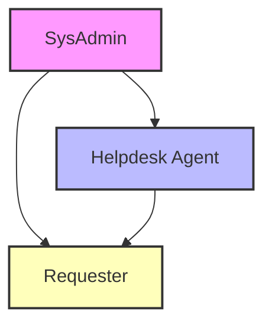
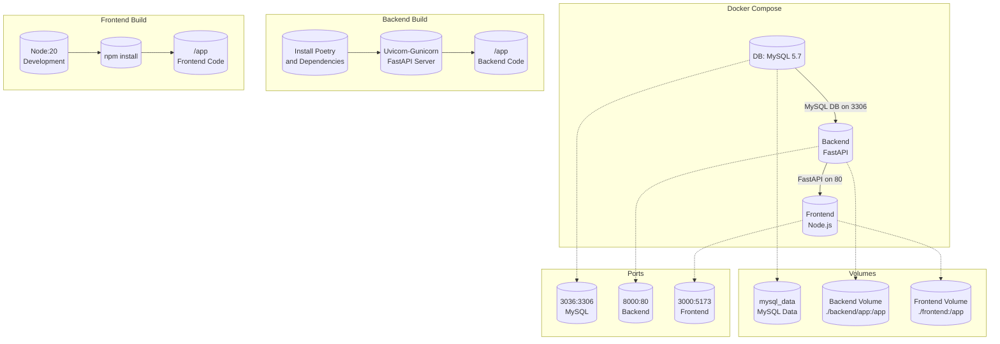
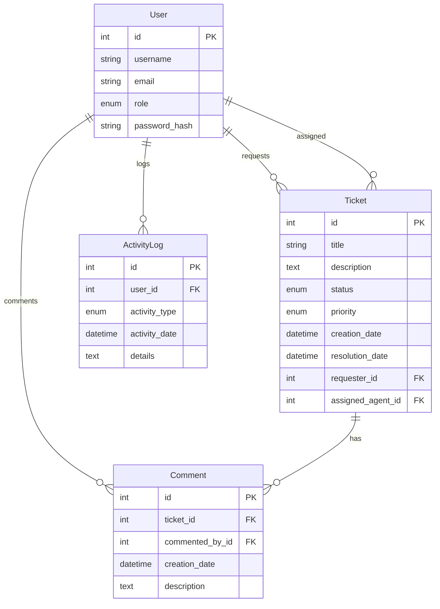
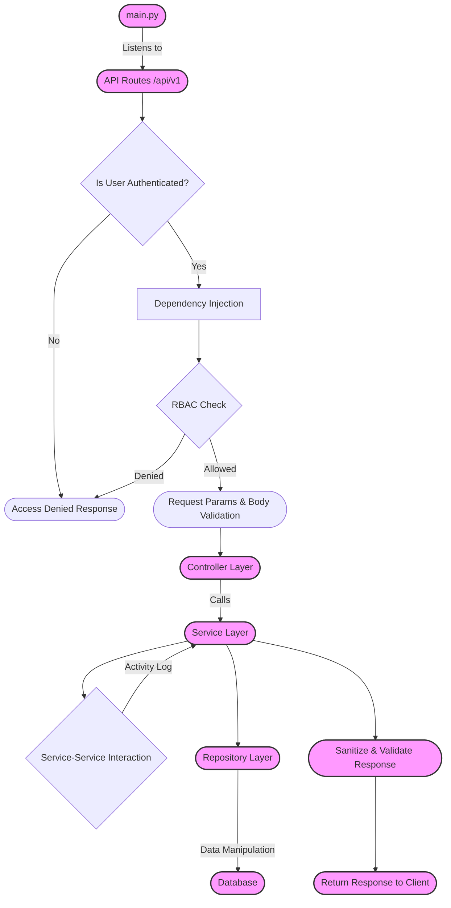

# Table of Contents

- [1 Ticket Management System (TMS)](#1-ticket-management-system-tms)
  - [1.1 Background Information](#11-background-information)
  - [1.2 Role-Role Interactions](#12-role-role-interactions)
  - [1.3 Technology Stack and Features](#13-technology-stack-and-features)
    - [1.3.1 Backend](#131-backend)
    - [1.3.2 Frontend](#132-frontend)
    - [1.3.3 AWS Cloud Services](#133-aws-cloud-services)
  - [1.4 Development and Deployment](#14-development-and-deployment)
  - [1.5 Prerequisites](#15-prerequisites)
  - [1.6 Local Development](#16-local-development)
    - [1.6.1 Running FastAPI Tests](#161-running-fastapi-tests)
    - [1.6.2 Running Vite Tests](#162-running-vite-tests)
- [2 Overview](#2-overview)
  - [2.1 Coding Conventions and Tooling](#21-coding-conventions-and-tooling)
    - [2.1.1 Backend](#211-backend)
    - [2.1.2 Frontend](#212-frontend)
  - [2.2 Authentication & Authorization - My Approach](#22-authentication--authorization---my-approach)
  - [2.3 Validation Backend to Frontend - My Approach](#23-validation-backend-to-frontend---my-approach)
  - [2.4 Notifications and Confirmations - Enhancing UX in My Application](#24-notifications-and-confirmations---enhancing-ux-in-my-application)
  - [2.5 Entity Relationships and Application Context](#25-entity-relationships-and-application-context)
- [3 Backend Architecture Overview](#3-backend-architecture-overview)
  - [3.1 Key Components of the Architecture](#31-key-components-of-the-architecture)
  - [3.2 Clean Architecture Benefits in TMS](#32-clean-architecture-benefits-in-tms)
  - [3.3 Flow](#33-flow)
  - [3.4 Other Programming Concepts Implemented](#34-other-programming-concepts-implemented)
  - [3.5 Folder Structure for Clean Architecture in TMS Backend](#35-folder-structure-for-clean-architecture-in-tms-backend)

# Table of Figures

- [Figure 1.1 Interaction between roles](#figure-11-interaction-between-roles)
- [Figure 1.2 Container Interactions between DB, Frontend, and Backend named services](#figure-12-container-interactions-between-db-frontend-and-backend-named-services)
- [Figure 1.3 Overview of TMS monorepo](#figure-13-overview-of-tms-monorepo)
- [Figure 1.4 TMS ERD](#figure-14-tms-erd)
- [Figure 1.5 Backend Flow Chart](#figure-15-backend-flow-chart)
- [Figure 1.6 Expanded view of backend folder structure](#figure-16-expanded-view-of-backend-folder-structure)

# 1 Ticket Management System (TMS)

##### Table 1.1: Applications Infrastructure and Services Status

| Service Type                   | URL                                                                                                                                                                                                | Status |
| ------------------------------ | -------------------------------------------------------------------------------------------------------------------------------------------------------------------------------------------------- | ------ |
| UI                             | [https://tms-applications.com/](https://tms-applications.com/)                                                                                                                                     | live   |
| API                            | [https://api.tms-applications.com/](https://api.tms-applications.com/)                                                                                                                             | live   |
| Swagger Doc                    | [https://api.tms-applications.com/docs](https://api.tms-applications.com/docs)                                                                                                                     | live   |
| Redoc                          | [https://api.tms-applications.com/redoc](https://api.tms-applications.com/redoc)                                                                                                                   | live   |
| AWS Cloudfront (UI)            | [d2as3jjp2p07h5.cloudfront.net](http://d2as3jjp2p07h5.cloudfront.net)                                                                                                                              | live   |
| AWS Cloudfront (API)           | [d16kkv1xslifdt.cloudfront.net](http://d16kkv1xslifdt.cloudfront.net)                                                                                                                              | live   |
| AWS S3 bucket (UI)             | [frontend-20240315035205-hostingbucket-dev.s3.eu-west-2.amazonaws.com](http://frontend-20240315035205-hostingbucket-dev.s3.eu-west-2.amazonaws.com)                                                | live   |
| AWS Elastic Load Balancer(API) | [awseb--awseb-lbsnntg6itof-973095914.eu-west-2.elb.amazonaws.com](http://awseb--awseb-lbsnntg6itof-973095914.eu-west-2.elb.amazonaws.com)                                                          | live   |
| AWS EBS (API)                  | [backend-prod.eba-5vrqj8mx.eu-west-2.elasticbeanstalk.com](http://backend-prod.eba-5vrqj8mx.eu-west-2.elasticbeanstalk.com)                                                                        | live   |
| AWS RDS (API)                  | [awseb-e-uapxgq8m35-stack-awsebrdsdatabase-3c0m1cc1hhjn.czcom40qetd2.eu-west-2.rds.amazonaws.com](awseb-e-uapxgq8m35-stack-awsebrdsdatabase-3c0m1cc1hhjn.czcom40qetd2.eu-west-2.rds.amazonaws.com) | live   |

## 1.1 Background Information

This application is a comprehensive **Ticket Management System** designed to optimize the handling of support requests within organizations. It introduces a role-based access control system specifically tailored for three primary user roles: **Requesters**, **Helpdesk Agents**, and **SysAdmins**.

- **Requesters**: Have the ability to create, read and update, their own tickets, comments and ticket priorities. They can only view there own tickets
- **Helpdesk Agents**: Can do the above, and create read update for all tickets including ticket resolution date, status and assigned agent. They can view all tickets and they're assigned tickets.
- **Administrators**: Can do the above, and create, read, update, delete, all users, tickets, comments and system activities.

To manage the increasing volume of internal and customer-facing issues, an robust Ticket Management System is created named "TMS".

##### Table 1.2: users for TMS application

| User ID | Username        | Role           | Email                       | Password  | Notable Actions                                           |
| ------- | --------------- | -------------- | --------------------------- | --------- | --------------------------------------------------------- |
| 1       | Admin           | SysAdmin       | admin@example.com           | Hello123. | Resolved VPN issues, manages high-priority tickets        |
| 2       | Jane Doe        | Requester      | jane.doe@example.com        | Hello123. | Engages actively in ticket creation and follow-up         |
| 3       | John Smith      | Helpdesk Agent | john.smith@example.com      | Hello123. | Addresses technical issues, including email sync problems |
| 4       | Alex Johnson    | Helpdesk Agent | alex.johnson@example.com    | Hello123. | Participates in resolving login issues                    |
| 5       | Emily White     | Helpdesk Agent | emily.white@example.com     | Hello123. | Involved in software installation tickets                 |
| 6       | Michael Brown   | Requester      | michael.brown@example.com   | Hello123. | Raises awareness about email syncing issues               |
| 7       | Sophia Martinez | Requester      | sophia.martinez@example.com | Hello123. | Initiates a ticket to update contact information          |
| 8       | Chloe Taylor    | Requester      | chloe.taylor@example.com    | Hello123. | Reports the printer malfunction on the 3rd floor          |
| 9       | David Wilson    | Requester      | david.wilson@example.com    | Hello123. | Requests password resets                                  |
| 10      | James Anderson  | Requester      | james.anderson@example.com  | Hello123. | Seeks updates to contact information                      |
| 11      | Isabella Thomas | Requester      | isabella.thomas@example.com | Hello123. | Reports laptop overheating issues                         |

### 1.2 Role-Role Interactions

- **SysAdmin (A)**: This role oversees the entire TMS system, ensuring everything runs smoothly. SysAdmins have the highest level of access, allowing them to manage user roles and tackle high-level issues.
- **Helpdesk Agent (B)**: Helpdesk Agents are directly under SysAdmins in the hierarchy. They are responsible for addressing the tickets raised by Requesters, providing solutions, and ensuring user satisfaction.
- **Requester (C)**: Requesters are the end-users who initiate tickets when they encounter issues or need assistance. They interact with the system primarily through the Helpdesk Agents.

##### Figure 1.1: Interaction between roles



## 1.3 Technology Stack and Features

### 1.3.1 Backend

Built with **FastAPI** at its core, the backend is optimized for performance and ease of use, offering the following features:

- **FastAPI:** A modern, fast web framework for building APIs with Python 3.10+.
  - **SqlAlchemy:** A SQL toolkit and Object-Relational Mapping (ORM) library for Python.
  - **Pydantic:** Used for data validation and settings management via data parsing and serialization.
  - **fastapi-pagination:** paginate database queries and return paginated responses to clients.
  - **MySQL:** Chosen for its robustness as the SQL database solution.
  - **Security:** Implements secure password hashing and JWT token authentication following OAuth2 protocol.
  - **Code Quality:** Utilizes Black and flake8 for linting and formatting to maintain code quality.
  - **Architecture:** Employs a clean architecture including router, repository, service, and database layers.
  - **Poetry:** For efficient Python package and environment management.
- **Testing:**
  - **Pytest:** Utilized for writing and running tests. Includes support for a test database, transaction rollbacks, and reusable Pytest fixtures.

### 1.3.2 Frontend

The frontend is powered by **React**, providing a responsive and dynamic user experience:

- **React:** A declarative, efficient, and flexible JavaScript library for building user interfaces.
  - **Vite:** A modern build tool that significantly improves the frontend development experience.
  - **State Management:** Leveraging Redux Toolkit for efficient state management.
  - **API Management:** RTK Query for optimized API calls.
  - **Styling:** Integrates TailwindCSS along with DaisyUI for a wide range of aesthetic and responsive components.
  - **Dark Mode:** Offers built-in dark mode support for improved user accessibility and preference.
  - **Code Quality:** Adopts Prettier and ESLint (following the Airbnb style guide) for code linting and formatting.
  - **Architecture:** Follows the Flux architecture pattern for predictable state management across the application.

### 1.3.3 AWS Cloud Services

To enhance deployment, scalability, and global reach, TMS incorporates various AWS services:

- **AWS Amplify**: Utilizes S3 for storage solutions, simplifying the setup and deployment of mobile and web applications with scalable environments.
- **Elastic Beanstalk (EBS)**: Incorporates ECS on EC2 instances within a VPC for secure and scalable hosting, with ELB (Elastic Load Balancing) to distribute incoming traffic, optimizing application performance.
- **Amazon Relational Database (RDS)**: Utilizes RDS for mysql database incorporated within EBS
- **Route 53**: Manages DNS records and routes end-user requests to application endpoints, facilitating efficient and reliable access to the TMS platform.
- **CloudFront**: A content delivery network (CDN) service that accelerates the delivery of data, videos, applications, and APIs to users globally, reducing latency and improving the user experience.

### 1.4 Development and Deployment

- **Docker Compose:** For simplifying the development and deployment process through containerization.
- **Pre-commit:** Configured to automatically lint and format code on every git commit, ensuring code quality from the start.

## 1.5 Prerequisites

Before you begin, ensure you have the following software installed on your system:

- **Docker**: A platform for developing, shipping, and running applications. Download and install Docker from [https://www.docker.com/](https://www.docker.com/).
  **note** - python or node is not required to be downloaded since it is all implemented via dockerfiles and dependencies are managed by depenency managers (poetry and npm)

Ensure that these tools are correctly installed by running the following commands in your terminal:

```bash
docker --version
docker-compose --version
```

Clone the project

```bash
git clone https://github.com/AL-SAFWAN/tms.git
cd tms
```

## 1.6 Local Development

To set up the local development environment for the UI, API, and Database components, follow these steps:

1. **Start the Services**:

   Use Docker Compose to build and start the services. This will build the UI, API, and DB containers. To view the logs in real-time, simply run:

   ```bash
   docker-compose up --build
   ```

   If you prefer to run the services in detached mode (in the background) and not see the logs in the console, add the -d flag:

   ```bash
   docker-compose up --build -d
   ```

   If you perfer to run indidual service then run:

   - UI service name **frontend** running on https://localhost:3000/
   - API service name **backend** running on https://localhost:8000/
   - DB service name **db** running on https://localhost:3306/

   ```bash
   docker-compose up --build -d <replace-with-service-name>
   ```

   **note** - when starting or restarting the db service, it will always execute the init.sql script in the mysql-init folder to pre-populate the database

   If you want to remove all containier, volume and network:

   ```bash
   docker-compose down -v
   [+] Running 5/5
     ✔ Container tms-frontend-1  Removed                                                                               0.0s
     ✔ Container tms-backend-1   Removed                                                                               0.0s
     ✔ Container tms-db-1        Removed                                                                               0.0s
     ✔ Volume tms_mysql_data     Removed                                                                               0.2s
     ✔ Network tms_default       Removed                                                                               0.5s
   ```

2. **Successful Build Output**:
   Upon executing the docker-compose up --build command, you will see output indicating the successful creation of the backend, frontend, and database containers.
   ```bash
   [+] Building 44.2s (22/22) FINISHED
   ...
   [+] Running 3/3
   ✔ Container tms-db-1        Created
   ✔ Container tms-frontend-1  Recreated
   ✔ Container tms-backend-1   Recreated
    Attaching to tms-backend-1, tms-db-1, tms-frontend-1
   ...
    tms-backend-1   | INFO:     Application startup complete.
   ```
3. **Check Running Containers**:
   ```bash
   docker ps
   ```
4. **Viewing Logs**:
   ```bash
   docker logs <container_name>
   ```
   or
   ```bash
   docker-compose logs <service_name>
   ```
5. **Entering into a container environent**:
   ```bash
    docker exec -it $(docker ps -q --filter ancestor=<docker_image_name>) bash
   ```
   or
   ```bash
    docker exec -it <container_id> bash
   ```

### Architecture and Container Interaction of TMS Application Development Environment

##### Fingure 1.2: Container Interactions between DB, Frontend and Backend named services



### 1.6.1 Running fastapi test

```bash
docker exec $(docker ps -q --filter ancestor=tms-backend) pytest
```

**Successful Test Output**:

```bash
============================= test session starts ==============================
platform linux -- Python 3.10.14, pytest-8.1.1, pluggy-1.4.0
rootdir: /app
configfile: pyproject.toml
plugins: anyio-4.3.0
collected 29 items

test/api/routes/test_auth.py ..                                          [  6%]
test/api/routes/test_comments.py ...                                     [ 17%]
test/api/routes/test_tickets.py ....                                     [ 31%]
test/crud/test_activity_logs.py .....                                    [ 48%]
test/crud/test_comment.py ....                                           [ 62%]
test/crud/test_ticket.py .....                                           [ 79%]
test/crud/test_users.py ......                                           [100%]

============================== 29 passed in 5.52s ==============================
```

# 2 Overview

##### Figure 1.3: Overview of TMS monorepo

```
/tms
│ └──/backend
│     ├── .ebextensions
│     │   └─ 01_fastapi.config
│     ├── .elasticbeanstalk
│     │   └─config.yml
│     ├── Dockerfile
│     ├── Procfile
│     ├── env
│     └──/app
│         ├── /api                # API route handlers (controllers)
│         │   └─ /v1              # Versioning of the API
│         ├── /core               # Contains configurations
│         ├── /db                 # Database related files
│         ├── /repositories       # Database access layer
│         ├── /schemas            # Pydantic models for request and response data validation
│         ├── /services           # Business logic layer
│         ├── /tests              # Test suites
│         ├── poetry.lock
│         ├── pyporoject.toml
│         ├── README.md
│         └── main.py             # Entry point of the FastAPI application
│
├── /frontend
│    ├── /public                  # Public assets and static files like index.html
│    ├── /src                     # Source files for the React application
│    │    ├── /assets             # Static assets like images, styles, etc.
│    │    ├── /components         # React components
│    │    ├── /hooks              # React custom hooks
│    │    ├── /pages              # React components representing pages
│    │    └── /utils              # Utility functions and helpers
│    └── vite.config.js           # Vite configuration
│
│
├── /mysql-init         # SQL Scripts
│    └── init.sql       # Create Initial database
├── Dockerfile          # Docker configuration for building images
├──.gitignore           # Specifies intentionally untracked files to ignore
└──.pre-commit-config   # Configuration for Black (formatting) and Flake8 (linting)
```

## 2.1 Coding conventions and tooling to reinforce to industry standard and best practice

configured with pre-commit to reinforce standards of every git commit

### 2.1.1 Backend

- **Naming Conventions**:
  - **Variables & Functions**: I use `snake_case`.
  - **Classes**: I stick to `CapWords` (PascalCase).
  - **Modules**: I prefer short, lowercase names, adding underscores for readability.
- **Indentation**:
  - I follow the PEP 8 standard of 4 spaces per indentation level.
- **Comments**:
  - I use inline comments to explain "why" rather than "what".
  - For functions and methods, I rely on docstrings to describe their purpose, parameters, and returns.
- **Refactoring**:
  - I aim to keep functions and classes short and focused on a single responsibility.
  - I use Pydantic models for clean and concise request/response validation.
  - Dependency injection is a go-to for modular and reusable logic.
- **Tooling**:
  - **Black**: For consistent code formatting across my codebase.
  - **Flake8**: For linting, ensuring I stick to best practices and avoid potential errors.

### 2.1.2 Frontend

- **Naming Conventions**:
  - **Variables & Functions**: I follow `camelCase`.
  - **Components & Files**: For React components and their files, I use `PascalCase`.
  - **Folders**: I used `snake_case`.
- **Indentation**:
  - I use 2 spaces per indentation level for better readability.
- **Comments**:
  - In JSX, I use `{/* ... */}` for multi-line comments.
  - For JavaScript, `//` is my go-to for single-line comments.
- **Refactoring**:
  - I break down large components into smaller, reusable ones.
  - React Hooks are essential in my functional components for state and effects management.
- **Tooling**:
  - **ESLint**: It's crucial for enforcing coding standards and catching issues early.
  - **Prettier**: Works hand-in-hand with ESLint to format my code automatically, ensuring consistency.

## 2.2 Authentication & Authorization - My Approach (OAuth 2.0 Implemetion)

### My Authentication Flow with FastAPI

- **Signing Up New Users**
  - **Process**: In my `AuthService`, the `sign_up_new_user` method is pivotal. I start by checking if the provided email already exists in our database using `self.user_service.read_user_by_email`. If it's a new email, I proceed to hash the user's password with `self.get_password_hash`, and then use `self.user_service.create_user` to save the new user, including their username, role, email, and hashed password.
- **User Login**
  - **Authentication**: The `authenticate_user` method is responsible for logging in users. It fetches the user by their email and verifies the provided password against the stored hash with `self.verify_password`. A successful match authenticates the user, returning the user object; a failure returns `False`.
- **Token Generation**
  - **JWT Tokens**: Successfully authenticated users receive a JWT token via the `create_access_token` method. This method embeds user data and an expiry into the token, which is then encoded using a secret key and algorithm. This JWT token is essential for maintaining user sessions and identity across requests.

### My Authorization Strategy

- **Role-Based Access Control (RBAC)**
  - **Implementing RBAC**: I use methods like `user_auth_required`, `admin_auth_required`, and `agent_auth_required` for authorization. These leverage `get_user_from_token` to decode the JWT, extracting the username and role. This step is crucial for enforcing access based on user roles.
- **Handling Token Issues**
  - **Expirations and Errors**: My system is equipped to handle token expirations and errors gracefully. In `get_user_from_token`, I specifically look for `ExpiredSignatureError` and `JWTError` to catch and respond to token issues, ensuring the client is informed of any authentication or authorization problems.

### Intergration With React

- **Storing and Managing Tokens**: Upon receiving a JWT token from my backend, the React app stores this token securely in the user slice, considering the application's security needs.
- **Sending Token in Requests(Authorization Header)**: My React app ensures that every request to protected endpoints includes the JWT token in the `Authorization` header, allowing my backend to verify the request's authenticity and permissions using RTK Query.
- **Authentication State & Navigation**: The React app dynamically updates its UI and navigational options based on the user's authentication state, enhancing user experience and security while maintaining navigation state during token expiration.
- **RBAC UI**: Leveraging the roles encoded in the JWT, my React app controls access to different components and routes, ensuring users only interact with parts of the application relevant to their roles.

## 3.3 Validation Backend to Frontend - My Approach (dual-layered validation)

- **Backend: FastAPI with Pydantic Validation**

  - **Pydantic Models** - I use Pydantic models to define the expected data structure for incoming requests. This includes specifying types for each field and any additional validation requirements, such as minimum lengths or regex patterns for fields.
  - **Email Validation** - common validation requirement is verifying email formats. Pydantic allows for straightforward email validation using `EmailStr` in model definitions. This ensures that any email data conforms to a valid format before any processing occurs.
  - **Error Handling** - Automatic Responses, When a request fails validation, FastAPI automatically returns a detailed error response. This includes which fields failed validation and why, making it easier for frontend developers to display appropriate feedback to users.

- **Frontend: React with Yup and Formik**
  - **Formik for Form Management** - I use Formik to handle form state in React. It abstracts away the boilerplate for managing form inputs, submissions, and validations, making the process more straightforward.
  - **Yup for Schema Validation** - Coupled with Formik, I employ Yup to define validation schemas for my forms. This includes specifying requirements for fields, such as required fields, string lengths, and custom validations like regex patterns for emails.
  - **Integrating Yup with Formik**- Formik’s integration with Yup allows for validations to run automatically on form submission and field changes. If validations fail, Formik makes error messages available to be displayed in the UI, offering immediate feedback to the user.
  - **User Feedback** - The combination of Yup and Formik provides users with immediate feedback on validation errors. This includes highlighting fields that require attention and displaying error messages defined in the Yup schema, improving the overall user experience.

In my project, the combination of FastAPI with Pydantic on the backend and React with Yup and Formik on the frontend forms a robust validation framework. This ensures that data integrity is maintained from the point of input in the UI to the backend processing. It not only safeguards against invalid data but also enhances user interaction by providing clear, immediate validation feedback.

## 2.4 Notifications and Confirmations - Enhancing UX in My Application

- **Notifications via Redux Middleware and RTK Query**

  - **Middleware Integration**: I have integrated Redux middleware with RTK Query to intercept all outgoing requests. This setup allows me to listen to the lifecycle of each request, particularly focusing on their completion status.
  - **Status Code Handling**: Based on the response status code from each request, the middleware decides when to trigger a notification. For instance, a successful operation (e.g., status code 200) results in a success notification, whereas an error (e.g., status code 400 or 500) triggers an error notification to the user.
  - **Popup Notifications**: Upon determining the type of notification, a popup is dynamically generated to inform the user. This approach ensures that users are always aware of the outcomes of their actions, enhancing the overall user experience.

- **Confirmations for Deletions with a Reusable React Component**
  - **Reusable Component Design**:To handle deletions, I've designed a reusable React component that encapsulates the confirmation logic. This component is designed to be easily integrated wherever a confirmation for deletion is required, maintaining consistency across the UI.
  - **Popup Confirmation UI**: When a user initiates a delete action, instead of immediately executing the deletion, the component renders a confirmation popup in the UI. This ensures that users have a chance to review their decision, preventing accidental deletions.
  - **Action on Confirmation**: The actual deletion action is only dispatched if the user confirms the deletion by clicking the 'Yes' button in the popup. This design pattern not only enhances the safety of user data but also contributes to a more intentional and user-friendly interface.

By integrating notifications through Redux middleware with RTK Query and employing a reusable component for deletion confirmations, my application provides timely feedback and ensures user actions are deliberate. This setup not only improves the application's interactivity and responsiveness but also safeguards against potential user errors, making the user experience as intuitive and seamless as possible.

# TMS Entiry Relationship Diagram

##### Figure 1.4: TMS ERD



## 2.5 Entity Relationships and with Application context

### Users

The `Users` table is central to the TMS, containing information about individuals interacting with the system. Each user has a distinct ID, username, email, role (Requester, Helpdesk Agent, or SysAdmin), and a hashed password for security.

- **Requests Tickets**: Users with the role of Requester can create tickets, indicating a one-to-many relationship between `Users` and `Tickets` (one user can request multiple tickets).
- **Assigned Tickets**: Users with the role of Helpdesk Agent can be assigned to tickets, which is also a one-to-many relationship (one agent can be assigned to multiple tickets).
- **Comments**: Users can leave comments on tickets, signifying a one-to-many relationship between `Users` and `Comments` (a user can make multiple comments on different tickets).
- **Activity Logs**: Every user action (like ticket and comment creation, updates, or deletions) is logged, showing a one-to-many relationship between `Users` and `ActivityLogs` (a user can have multiple activity log entries).

### Tickets

`Tickets` represent submitted issues, inquiries, or requests. They include details like title, description, priority, status, creation and (optionally) resolution dates, and link back to the requester and the assigned agent.

- **Requester**: Connects to the `Users` table to identify who raised the ticket, a many-to-one relationship (many tickets can be requested by a single user).
- **Assigned Agent**: Also links to the `Users` table but specifies the Helpdesk Agent assigned to resolve the ticket, another many-to-one relationship (many tickets can be assigned to a single agent, though some may not be assigned right away).
- **Comments**: Has a one-to-many relationship with the `Comments` table since a ticket can have multiple comments, facilitating discussion and updates on the ticket's resolution.

### Comments

`Comments` enable discussion about a ticket between users and helpdesk agents. Each comment is tied to a specific ticket and authored by a user.

- **Linked to Tickets**: Establishes a many-to-one relationship with `Tickets`, as multiple comments can pertain to a single ticket.
- **Made by Users**: Indicates a many-to-one relationship with `Users`, as a user can author multiple comments on various tickets.

### ActivityLogs

`ActivityLogs` chronicle the actions users take within the TMS, such as creating, updating, or viewing tickets and comments, detailing the activity type and timestamp.

- **User Activities**: Demonstrates a one-to-many relationship with `Users`, as multiple activity logs can be generated by a single user's actions within the system.

This outline elucidates how the TMS's entities interact, offering a comprehensive overview of the system's structure and the flow of data.

# 3 Backend Architecture Overview

The backend of the Ticket Management System (TMS) is designed following the principles of Clean Architecture, ensuring the separation of concerns, scalability, and ease of maintenance. This architecture allows us to decouple the system into independent layers, each with a specific responsibility, enhancing the testability and flexibility of the codebase.

## 3.1 Key Components of the Architecture

- **Entities/Models (`/models`):** These are the core business objects of my application. They represent the data and the business rules that govern that data. In context, entities include `User`, `Ticket`, and `ActivityLog`.

- **Use Cases/Services (`/services`):** This layer contains the application-specific business rules. It orchestrates the flow of data to and from the entities and directs those entities to use their business rules to achieve the goals of the use cases. Examples include user registration, ticket creation, and processing of activity logs.

- **Interface Adapters (`/api`, `/repositories`):**

  - **Controllers/Routers (`/api`):** These act as the entry point for the external world into my application. They translate HTTP requests into calls to my use case services and then return the appropriate HTTP response.
  - **Repositories (`/repositories`):** Repositories abstract the logic required to access data sources. They make it easier to perform CRUD operations on my entities without exposing the business layers to the specifics of database access.

- **Frameworks and Drivers:**
  - **FastAPI:** Serves as the web framework, enabling the creation of RESTful endpoints.
  - **SQLAlchemy:** Used as the ORM for interacting with the database, abstracted by my repository layer.
  - **Pydantic:** Provides data validation and settings management through data parsing and serialization.

## 3.2 Clean Architecture Benefits in TMS

- **Independence from Frameworks:** The business logic of the application (services and entities) is not bound to the FastAPI framework, making it easier to migrate or upgrade frameworks if necessary.

- **Testability:** Each layer can be tested independently. Business logic can be tested without UI, database, web server, or any external element.

- **UI-agnostic:** The same business logic can support different user interfaces (Web API, CLI, etc.) without change.

- **Database-agnostic:** Changing the SQL database to a NoSQL database or vice versa affects only the repository layer, not the business logic.

## 3.3 Flow

The `main.py` file serves as the entry point for the Ticket Management System (TMS). It initializes the application and listens to all the routes defined in the `app` object, which point to the endpoints under `api/v1`. Here's a breakdown of how the flow works within the TMS backend:

- **Route Protection:** When a route is hit, it ensures that the user is authenticated (logged in with a token). This is implemented using dependency injection to inject the database instance and RBAC (Role-Based Access Control) protection into the route handlers.

- **Data Validation and RBAC:** At this layer, the routes validate the request parameters and body using Pydantic schemas. It also handles custom business logic for response validation, such as ensuring a user has the appropriate role to access a ticket or providing different sets of tickets based on the user's role.

- **Service Layer:** The API layer calls the appropriate services within the service layer, where each service contains the business logic necessary to perform its functions. This includes interacting with the repository layer for data access and manipulation. There is also interaction between services, such as the activity log service logging actions performed by other services.

- **Sanitization and Validation:** The service layer returns a sanitized object back to the endpoint, suitable for use by the client. This object is also validated using Pydantic schemas to ensure it meets the expected format and data types.

- **Pydantic Schemas:** Within my Pydantic schemas, I define CRUD-based classes, utilize inheritance to define a base model, and implement enums for field values. I also simulate SQL joins in the response model using Pydantic schemas to craft comprehensive and relational data responses.

This structured flow ensures that the TMS backend is secure, scalable, and maintainable, with clear separations of concerns and robust data validation at every step of the process.

##### Figure 1.5: Backend Flow Flow chart



### Explanation of the Diagram:

- **main.py**: The entry point of the application that listens to routes defined under `/api/v1`.
- **API Routes /api/v1**: The first layer that handles incoming requests.
- **Is User Authenticated?**: Checks if the user is authenticated.
- **Dependency Injection**: Injects dependencies such as the database instance.
- **RBAC Check**: Role-Based Access Control check to authorize user actions.
- **Request Params & Body Validation**: Validates request data using Pydantic schemas.
- **Controller Layer**: Manages custom business logic for request handling.
- **Service Layer**: Contains business logic and handles interactions with the repository layer or other services.
- **Service-Service Interaction**: Example interaction where the activity log service logs actions performed.
- **Repository Layer**: Interacts with the database for CRUD operations.
- **Database**: The actual database where data is stored and manipulated.
- **Sanitize & Validate Response**: Prepares and validates the response data to be sent back to the client.
- **Return Response to Client**: The final step where the response is sent back to the client.

### 3.4 Other programming concepts Implemented

1. **Async**: I use `async def` for route handlers to efficiently handle IO-bound operations and ensure high concurrency. This asynchronous programming approach greatly enhances the performance of my API by facilitating non-blocking execution of operations.

2. **Type Hints**: Throughout my project, I use Python type hints in conjunction with Pydantic models. This practice not only ensures type safety but also simplifies the process of converting request data into Python types, improving code clarity and reducing the chance of runtime errors.

3. **Dependency Injection**: FastAPI's dependency injection system has been instrumental in my project for sharing common logic like database connections and user authentication across different parts of the application. This modularity promotes code reusability and maintainability.

4. **Pydantic Models and OOP**: By defining data structures with Pydantic models, I align my project with Object-Oriented Programming (OOP) principles. These models encapsulate data validation and schema definition, supporting inheritance and data manipulation in a clean and modular fashion.

5. **Automatic API Documentation**: One of the great features of FastAPI that I've utilized is its automatic API documentation generation. This feature streamlines the testing and debugging process by ensuring that the documentation is always up-to-date and accurately reflects the capabilities of my API.

6. **Security and Authentication**: To secure my API, I've implemented support for OAuth2 with Password and JWT tokens, using libraries like `python-jose` and `passlib`. This setup protects my API endpoints from unauthorized access and ensures the security of user data.

7. **ORM Compatibility**: allows me to interact with the database using high-level Python code, making database management straightforward and efficient.

8. **Testing**: With `pytest`, I ensure that my application functions as expected through comprehensive testing. FastAPI's `TestClient` allows me to simulate API calls within my tests, facilitating both integration and unit testing with ease.

9. **Dependency Override**: FastAPI's feature for dependency override has been particularly useful for testing, allowing me to replace certain components with mocks or test versions. This capability is crucial for isolated testing, ensuring components can be tested under controlled conditions.

## 3.5 Folder Structure for Clean Architecture in TMS Backend

##### Figure 1.6: expanded view of backend folder structure

```
/backend
│ └──/app
│    │
│    ├── /api                # API route handlers (controllers)
│    │   └── /v1             # Versioning of the API
│    │   │   ├── auth.py
│    │   │   ├── activity_logs.py
│    │   │   ├── tickets.py
│    │   │   ├── comments.py
│    │   │   └── admin.py
│    │
│    ├── /core               # Contains configurations
│    │   └── /secuirty.py
│    │
│    ├── /db                 # Database related files
│    │   ├── /models         # SQLAlchemy models (entities)
│    │   │   ├── users.py
│    │   │   ├── tickets.py
│    │   │   ├── comments.py
│    │   │   └── activity_logs.py
│    │   └── database.py
│    │
│    ├── /repositories       # Abstraction layer for database access (repositories)
│    │   ├── user.py
│    │   ├── ticket.py
│    │   ├── comments.py
│    │   └── activity_log.py
│    │
│    ├── /schemas            # Pydantic models for request and response data validation
│    │   ├── user.py
│    │   ├── ticket.py
│    │   ├── comments.py
│    │   └── activity_log.py
│    │
│    ├── /services           # Business logic layer (use cases)
│    │   ├── user.py
│    │   ├── auth.py
│    │   ├── ticket.py
│    │   ├── comment.py
│    │   └── activity_log.py
│    │
│    ├── /tests              # Test suites for API, services, and repositories
│    │    └── /api           # Integration test
│    │    │   ├── test_auth.py
│    │    │   ├── test_tickets.py
│    │    │   └── test_comments.py
│    │    └── crud           # Unit test
│    │    │   ├── test_activity_log.py
│    │    │   ├── test_ticket.py
│    │    │   ├── test_user.py
│    │    │   └── test_comment.py
│    │    └ conftest         # contains configs, testing modules and fixtures
│    └── main.py             # Entry point of the FastAPI application
│
├── peotry.lock              # Poetry lock file for dependency management
├── pyproject.toml           # Poetry configuration file
├── Procfile
└── Dockerfile
```
