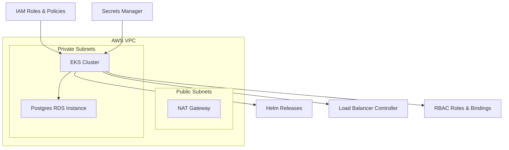
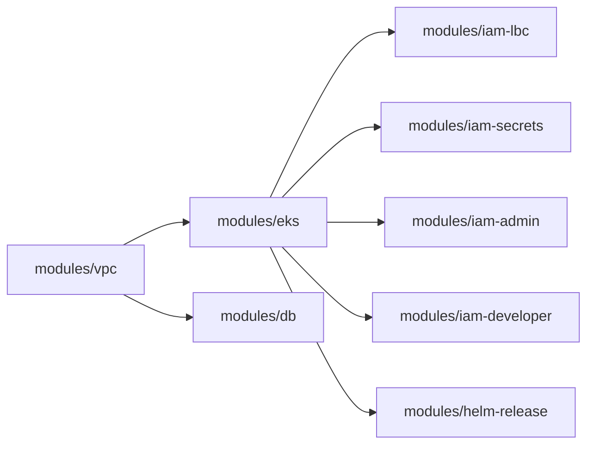
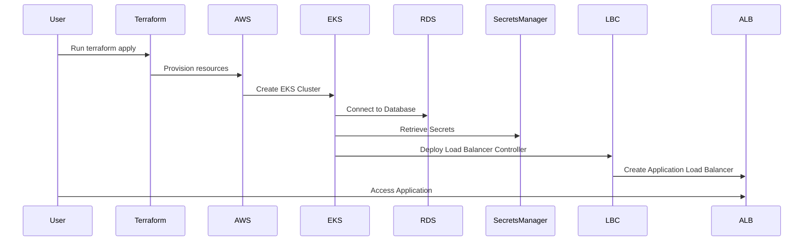

# Infrastructure as Code (IaC) Documentation

This document provides an overview of the Infrastructure as Code (IaC) setup using Terraform and Helm for managing multiple environments (e.g., development, testing, and production). The configuration follows a modular structure, promoting maintainability, scalability, and clear separation of concerns. This documentation adheres to academic standards by providing a structured, clear, and concise explanation of the infrastructure, as well as outlining the steps required to manage and deploy the environments effectively.

## Goals and Rationale

The primary objectives of this IaC setup are to:

1. **Modularize Infrastructure**: Break down the Terraform configuration into reusable modules (e.g., `vpc`, `eks`, `db`, and `iam`) that can be easily maintained, tested, and extended.
2. **Environment Separation**: Establish distinct directories and configuration files for different environments (e.g., `dev`, `test`, `prod`) to ensure environment-specific configurations do not interfere with each other.
3. **Scalability and Consistency**: Allow for the straightforward addition of new environments or components without duplicating large portions of code.
4. **Ease of Deployment**: Integrate Terraform and Helm to facilitate the automated deployment of Kubernetes infrastructure and applications.

## High-Level Architecture

- **AWS VPC**: A Virtual Private Cloud in AWS serving as the network boundary for the EKS cluster, subnets, and related resources.
- **EKS Cluster**: An Elastic Kubernetes Service cluster that hosts Kubernetes workloads, including web applications, secrets CSI drivers, and load balancer controllers.
- **Database (RDS)**: A Postgres database running in a private subnet within the VPC, accessed by the backend application.
- **IAM Roles & Policies**: IAM roles are used to provide granular permissions to EKS, its node groups, the AWS Load Balancer Controller (LBC), and applications needing access to AWS secrets.
- **Helm Releases**: Helm is used to deploy Kubernetes applications and services (e.g., the web-app, secrets-store CSI driver, AWS LBC).
- **Ingress with AWS Load Balancer Controller**: Kubernetes ingress resources manage HTTP/HTTPS routing into the cluster, backed by AWS Application Load Balancers (ALBs).
- **Secrets and RBAC**: Secrets are stored in AWS Secrets Manager, retrieved into Kubernetes pods via the Secrets Store CSI driver with IRSA (IAM Roles for Service Accounts). RBAC defines roles and bindings for admin, developer, and viewer groups.



## Modular Structure

The Terraform configuration has been divided into modules for clarity, reusability, and ease of maintenance:

- **modules/vpc**: Creates the AWS VPC, subnets, NAT gateways, route tables, and related networking resources.
- **modules/eks**: Sets up the EKS cluster, control plane IAM roles, and node groups.
- **modules/db**: Configures the RDS instance, DB subnet group, and security groups.
- **modules/iam-...**: Multiple IAM modules handle role creation for:
  - **iam-lbc**: IAM role and policies for the AWS Load Balancer Controller.
  - **iam-secrets**: IAM role and policy for accessing Secrets Manager via IRSA.
  - **iam-admin**: IAM roles for cluster admins.
  - **iam-developer**: IAM roles for developers with restricted EKS access.
- **modules/helm-release** (optional pattern): A generic module for deploying Helm charts, if needed.



### Kubernetes Components

```mermaid
mermaid
flowchart TD
HelmChart[Helm Chart: Web-App] --> Deployment[K8s Deployment]
Deployment --> ReplicaSet
ReplicaSet --> Pods
Service --> Pods
Ingress --> Service
ALB --> Ingress
```

This diagram shows the flow of the web application deployment from Helm charts to the application being accessible through the Application Load Balancer.

## Environment-Specific Structure

The code is organized to allow multiple environments (e.g., dev, test, prod, local). Each environment resides in its own directory under `environments/`, containing:

- **main.tf**: References modules and sets up environment-specific resources.
- **variables.tf** and **locals.tf**: Define environment-related variables and computed values.
- **backend.tf** and **providers.tf** (if needed): Configure remote state and providers per environment.
- **tfvars files** (e.g., `dev.tfvars`, `prod.tfvars`): Override variables for each environment.

By running `terraform init` and `terraform apply -var-file=<env>.tfvars` inside `environments/<env>`, the infrastructure is deployed with the appropriate settings and naming conventions for that environment (e.g., dev, test, prod).

## Flow of Components

### VPC Setup:

- **The vpc module** provisions a VPC, private and public subnets, NAT gateway, and route tables.
  - **Flow**: Other modules (EKS, RDS) consume `module.vpc` outputs to place resources in the correct subnets.

### EKS Cluster and Node Groups:

- **The eks module** sets up the control plane IAM role, the EKS cluster itself, and node groups.
  - **Flow**: The EKS cluster uses subnets from `module.vpc`. Node groups run in the private subnets. Outputs from the EKS module (e.g., cluster name, OIDC issuer) are used by IAM modules and Helm releases.

### IAM Roles and Policies:

- **Multiple IAM modules** create roles for:

  - **EKS cluster (control plane)**
  - **Nodes**
  - **Load Balancer Controller**
  - **Secrets Manager access via IRSA**
  - **Admin and developer roles**

  - **Flow**: Pods in EKS assume these roles using IRSA. For secrets, the `iam_secrets` module provides a role that allows the Secrets Store CSI driver to fetch secrets from AWS Secrets Manager.

### Database (RDS):

- **The db module** creates an RDS instance inside private subnets. It sets up a DB subnet group and a security group allowing access from within the VPC only.
  - **Flow**: Backend application pods in EKS retrieve DB credentials from Secrets Manager and connect to the RDS instance’s endpoint exposed by the `db` module’s outputs.

### Secrets Handling:

- **AWS Secrets Manager** stores sensitive values (like DB credentials). The EKS pods access these secrets via the Secrets Store CSI driver and IRSA.
  - **Flow**:
    - An IRSA-enabled ServiceAccount in `kube-system:myapp` is annotated with the IAM role from `iam_secrets`.
    - The Secrets Store CSI driver mounts the secret as a volume in the backend pod.
    - Environment variables in the backend pod reference the secret keys.

### RBAC (Role-Based Access Control):

- **Kubernetes RBAC** is configured using `k8s-rbac.tf`, creating ClusterRoles and ClusterRoleBindings.
  - **Flow**:
    - An admin role binds AWS IAM principals from the admin IAM module to the `my-admin` group.
    - A viewer role binds IAM principals to a `my-viewer` group.
    - Developer users get restricted EKS access mapped to `my-viewer`.
    - This ensures that each user or IAM role has the correct permissions within the cluster.

### Ingress and AWS Load Balancer Controller:

- **The AWS Load Balancer Controller** (installed via a Helm release) watches Ingress resources in the cluster and provisions AWS ALBs accordingly.
  - **Flow**:
    - `helm_release.aws_lbc` deploys the AWS Load Balancer Controller into the cluster.
    - Ingress resources (like `my-app-ingress`) are applied by `helm_release.web-app`.
    - The controller detects ingress changes and creates or updates an ALB.
    - `data "aws_lb"` retrieves the ALB DNS name.
    - Route 53 records are created pointing `environment_domain.domain_name` and `api.environment_domain.domain_name` to the ALB’s DNS name.



## Helm Releases

The web application (both frontend and backend) is deployed via Helm. Terraform’s `helm_release` resource fetches charts, applies environment-specific values, and configures service accounts and annotations for IRSA.

- **Flow**:
  - Terraform sets `serviceAccount.annotations` with `eks.amazonaws.com/role-arn` linking pods to the right IAM role.
  - The Helm chart deploys the application, referencing environment variables sourced from Secrets Manager mounts and `.tfvars` file overrides.
  - The Ingress resource from the Helm chart triggers the Load Balancer Controller to create the ALB.

## Environment Management

Per-Environment Directories: Each environment (dev, test, prod) has its own folder under `environments/`.

- **Variables and Locals**: Variables like `environment`, `domain_name`, and subnet details are defined in `variables.tf` and `locals.tf` inside each environment directory.
- **.tfvars Files**: `dev.tfvars`, `test.tfvars`, `prod.tfvars` set the `environment` variable and other overrides. Running `terraform apply -var-file=prod.tfvars` in `environments/prod` deploys the prod environment configuration.
